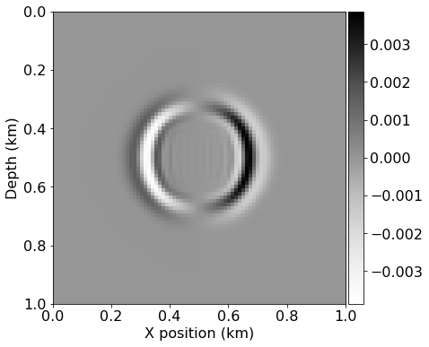

```python
from devito import *
from seismic.source import WaveletSource, TimeAxis
from seismic import plot_image
import numpy as np

from sympy import init_printing, latex
init_printing(use_latex='mathjax')
```


```python
# Initial grid: 1km x 1km, with spacing 100m
extent = (2000., 2000.)
shape = (81, 81)
x = SpaceDimension(name='x', spacing=Constant(name='h_x', value=extent[0]/(shape[0]-1)))
z = SpaceDimension(name='z', spacing=Constant(name='h_z', value=extent[1]/(shape[1]-1)))
grid = Grid(extent=extent, shape=shape, dimensions=(x, z))
```


```python
class DGaussSource(WaveletSource):
    
    def wavelet(self, f0, t):
        a = 0.004
        return -2.*a*(t - 1./f0) * np.exp(-a * (t - 1./f0)**2)

# Timestep size from Eq. 7 with V_p=6000. and dx=100
t0, tn = 0., 200.
dt = 1e2*(1. / np.sqrt(2.)) / 60.
time_range = TimeAxis(start=t0, stop=tn, step=dt)

src = DGaussSource(name='src', grid=grid, f0=0.01, time_range=time_range)
src.coordinates.data[:] = [1000., 1000.]
```


```python
#NBVAL_SKIP

src.show()
```


```python
# Now we create the velocity and pressure fields
p = TimeFunction(name='p', grid=grid, staggered=NODE, space_order=2, time_order=1)
v = VectorTimeFunction(name='v', grid=grid, space_order=2, time_order=1)
```


```python
from devito.finite_differences.operators import div, grad
t = grid.stepping_dim
time = grid.time_dim

# We need some initial conditions
V_p = 4.0
density = 1.

ro = 1/density * dt
l2m = V_p*V_p*density * dt

# The source injection term
src_p = src.inject(field=p.forward, expr=src)

# 2nd order acoustic according to fdelmoc
u_v_2 = Eq(v.forward, v + ro * grad(p))
u_p_2 = Eq(p.forward, p + l2m * div(v.forward))
```


```python
u_v_2
```


$\displaystyle \left[\begin{matrix}\operatorname{v_{x}}{\left(t + dt,x + \frac{h_{x}}{2},z \right)}\\\operatorname{v_{z}}{\left(t + dt,x,z + \frac{h_{z}}{2} \right)}\end{matrix}\right] = \left[\begin{matrix}\operatorname{v_{x}}{\left(t,x + \frac{h_{x}}{2},z \right)} + 1.17851130197758 \frac{\partial}{\partial x} p{\left(t,x,z \right)}\\\operatorname{v_{z}}{\left(t,x,z + \frac{h_{z}}{2} \right)} + 1.17851130197758 \frac{\partial}{\partial z} p{\left(t,x,z \right)}\end{matrix}\right]$


```python
u_p_2
```


$\displaystyle p{\left(t + dt,x,z \right)} = p{\left(t,x,z \right)} + 18.8561808316413 \frac{\partial}{\partial x} \operatorname{v_{x}}{\left(t + dt,x + \frac{h_{x}}{2},z \right)} + 18.8561808316413 \frac{\partial}{\partial z} \operatorname{v_{z}}{\left(t + dt,x,z + \frac{h_{z}}{2} \right)}$


```python
op_2 = Operator([u_v_2, u_p_2] + src_p)
```


```python
#NBVAL_IGNORE_OUTPUT

# Propagate the source
op_2(time=src.time_range.num-1)
```

    Operator `Kernel` run in 0.05 s


```python
#NBVAL_SKIP

# Let's see what we got....
plot_image(v[0].data[0])
plot_image(v[1].data[0])
plot_image(p.data[0])
```





```python
norm_p = norm(p)
assert np.isclose(norm_p, .35098, atol=1e-4, rtol=0)
```


```python
# # 4th order acoustic according to fdelmoc
# # Now we create the velocity and pressure fields
p4 = TimeFunction(name='p', grid=grid, staggered=NODE, space_order=4, time_order=1)
v4 = VectorTimeFunction(name='v', grid=grid, space_order=4, time_order=1)
u_v_4 = Eq(v4.forward, v4 + ro * grad(p4))
u_p_4 = Eq(p4.forward, p4 + l2m * div(v4.forward))
```


```python
#NBVAL_IGNORE_OUTPUT
op_4 = Operator([u_v_4, u_p_4] + src_p)
# Propagate the source
op_4(time=src.time_range.num-1)
```

    Operator `Kernel` run in 0.01 s


```python
#NBVAL_SKIP

# Let's see what we got....
plot_image(v4[0].data[-1])
plot_image(v4[1].data[-1])
plot_image(p4.data[-1])
```


```python
norm_p = norm(p)
assert np.isclose(norm_p, .35098, atol=1e-4, rtol=0)
```
